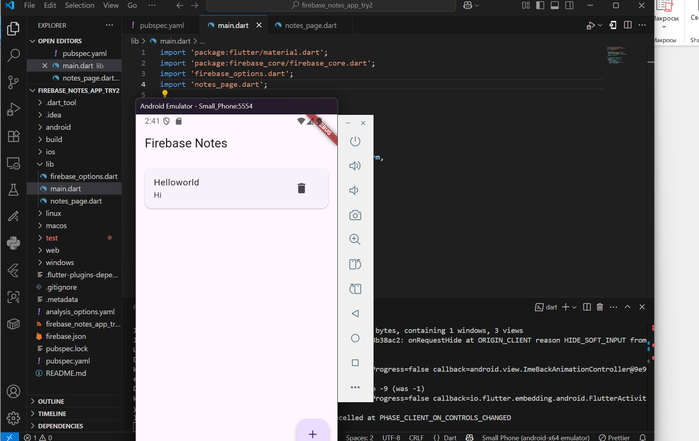

Отчёт: Firebase Notes App
📱 О проекте
Простое приложение для заметок с синхронизацией в облаке через Firebase.

✅ Что сделано
1. Настройка проекта
Создан Flutter проект

Подключен Firebase (Android)

Установлены пакеты: firebase_core, cloud_firestore

2. База данных
Firestore база в тестовом режиме

Коллекция notes с полями:

title - заголовок

content - текст

createdAt, updatedAt - даты

3. Функционал (CRUD)
Create - добавление новых заметок

Read - просмотр списка в реальном времени

Update - редактирование по нажатию

Delete - удаление через иконку корзины

4. Интерфейс
Material Design

Диалоговые окна для форм

Real-time обновления

Индикаторы загрузки

🛠 Технические детали
Архитектура: StatefulWidget + StreamBuilder

Состояние: Локальный state + Firebase streams

Безопасность: Правила "allow all" для разработки
📁 Структура проекта
text
main.dart          # Инициализация Firebase
notes_page.dart    # Главный экран с CRUD
🚀 Запуск

flutter pub get
flutter run

